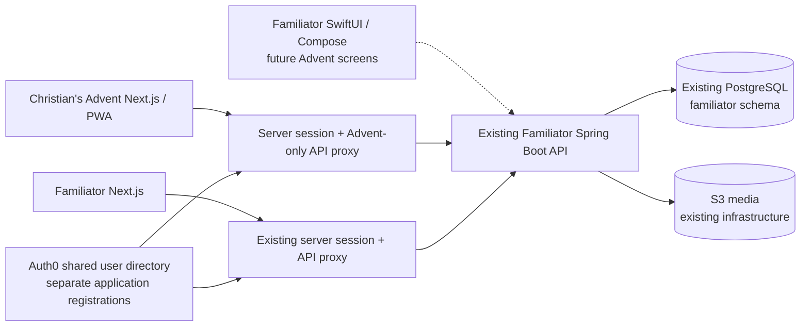

# Christian's Advent + Familiator: implementation audit and architecture

Reviewed locally on September 27, 2026. This is a source audit plus the checks recorded below, not a claim that every feature has passed live-device or production QA.

## What Familiator already contains

| Area | Current implementation | Limits relevant to Advent |
| --- | --- | --- |
| Family calendar | Web month/event views; native month/agenda views; event categories and saved per-person filters, school/district/child filters | No general recurring-event rule engine; private household access must not be reused for coworkers |
| School calendars | Image/PDF preservation, configurable vision extraction, legend/date review, school/year/child assignment, atomic confirmation and undo | Live vision QA still required; no revised-calendar diff/merge or comprehensive cross-upload deduplication |
| Holiday cards | Household preferences, religious/cultural Christmas and Easter choices, server-selected art, per-person/day delivery claim, dismissals and metadata-only upcoming list | One-time launch cards are different from a collection of doors that can be reread; no universal holiday feed or editorial CMS |
| Identity | Auth0 web/native clients, audience/issuer validation in API, household membership and permissions, non-login child profiles | Sharing an identity does not imply membership in another household/product |
| Storage | PostgreSQL, Flyway migrator/runtime split, S3 original and display images, private download authorization | S3 alone cannot sensibly replace transactional memberships, invitations, unlock records and future sales/order state |
| Other product areas | Meals/recipes/shopping; task records; expanded medication, vehicles, insurance/privacy, travel/telemetry modules | Several advanced features are feature-gated and still need connected/device QA; not dependencies of Advent |
| Native apps | SwiftUI iOS and Kotlin/Compose Android; source includes calendar, school import and existing celebration settings/readers | This pass does not add the new Advent calendar screens to native clients or rerun their SDK builds |

Evidence: `familiator-api/docs/calendar-filters.md`, `school-calendars.md`, `celebrations.md`, `app-parity.md`; API controllers/migrations; `familiator-ios/Familiator/ContentView.swift`; Android `CalendarMonth.kt`, `SchoolCalendars.kt`, `LaunchCelebration.kt`. Older implementation-status documents contain superseded local-database/configuration descriptions; this design uses current code.

## Architecture decision

Keep one deployed Java service for now. Add a cohesive Advent feature, not a second database, second identity store, or another always-on service. Both web frontends call `/v1/advent/calendars` with the same API audience. Do not expose API tokens in browser JavaScript.

A Christian's Advent Auth0 application uses the **same tenant and user connection** as the matching Familiator environment, with its own client ID, secret, callback and logout URLs. The Next.js apps each own a first-party session cookie; they do not share cookies across domains. The identity-provider session can reduce repeated login prompts. Separate user databases with matching email addresses do not provide this behavior: use the same underlying subject, never auto-link users by email.

There is no automatic Familiator household creation. A standalone user can create/join celebration calendars. Later they can sign into Familiator and independently create/join a household. The first slice represents Advent participation through calendar memberships; it does **not** yet implement paid product entitlements, cross-product marketing consent, or subscription management.

Existing household authorization stays intact. Mike’s web proxy permits only Advent routes. The API independently checks calendar membership on every read/write; a limited frontend proxy is not the API’s security boundary.

## Data and API added in this pass

Flyway `V19__advent_calendars.sql`, within the existing configured schema:

- `advent_calendars`: name, year, timezone, presentation, optional shared tradition, Thanksgiving option, template version.
- `advent_members`: identity subject, calendar-scoped display name, OWNER/MEMBER. No household foreign key or automatic membership.
- `advent_days`: day 1–25 (December), optional day 0 (fourth Thursday in November), copied text, publication state, optimistic version.
- `advent_opens`: per-person first-open record. Opening is idempotent; all past published days remain readable.
- `advent_invitations`: SHA-256 token hashes, seven-day expiry, single use. One outstanding code per calendar; a new one replaces the old one. Share codes privately. Possession allows redemption; they are not yet email-bound invitations.

| Method / path relative to `/v1/advent/calendars` | Permission / behavior |
| --- | --- |
| GET `/` | List authenticated person’s calendars only |
| POST `/` | Create calendar and owner membership, without a household |
| GET `/{id}/doors` | Member; dates/states/opened flags only, no messages or future titles |
| POST `/{id}/doors/{day}/open` | Member; enforce date in calendar timezone and published flag; record first open |
| GET `/{id}/editor` | Owner only; explicit access to future text |
| PUT `/{id}/doors/{day}` | Owner only; version-checked content/publication edit |
| POST `/{id}/invitations` | Owner; issue one-use private code |
| DELETE `/{id}/invitations` | Owner; revoke outstanding code |
| POST `/join` | Authenticated person with code and displayName; adds calendar membership only |
| GET `/{id}/members` | Owner; calendar membership IDs/names/roles, not identity-provider subjects |
| DELETE `/{id}/members/{membership}` | Owner; remove a guest’s access (cannot remove owner) |

All successful responses are `Cache-Control: no-store`. Mutations in each browser proxy require the configured application origin. Auth0 access tokens remain server-side. No HTML rendering of user text.

Time is authoritative on the server, not the phone/browser. Year and timezone are immutable in this first version. Future text is not downloaded by the reader at all. Owner preview is a separate, deliberate operation. Editorial changes are version-checked but not immutable history: changing a published door changes later rereads, too. Users refresh the page/list when a new day begins; no background midnight polling is needed yet.

Starter prompts are original text, copied into a calendar at creation under `christmas-starter-v1`. They are editable and initially published, but still date-locked. Presentation choices add optional Christian reflection to the common activities. Free-text denomination is descriptive; it does not silently infer doctrinal choices or schedule denominational events. No copyrighted hymn/scripture translations or coworker likenesses have been imported.

## Frontend responsibilities

**Christian's Advent:** public storybook-inspired landing page; separate Auth0 integration; calendar creation/joining/reading; owner editing, invitations and removal; install manifest/icons and public offline fallback. Generic CSS/SVG house art is a starting direction, not a recreation of the “Christian goes to…” covers.

**Familiator web:** `/celebrations` navigation independent of the selected household; same calendar list/create/join/read API. Authoring and invitation administration link to Christian's Advent (override `MIKES_ADVENT_URL` for a matching lower lane). No duplicate calendar rows or synchronization job. Its existing blue/white styling is retained.

These are two separate UI implementations with different authoring scope; the source is not yet extracted into an npm package. The shared Java API is the authority for membership, dates, and content. Extract a shared React reader only when both screens settle, through the normal agile-ui publication pipeline rather than fragile cross-repository runtime imports.

The old daily-launch holiday system is preserved. New Advent doors are not copied into `records/event`, so they do not flood the family calendar. A future explicit “Add this gathering to my household calendar” action should create a linked event after confirming household and audience; accepting a coworker invitation must never do that implicitly.

## PWA recommendation

Start Christian's Advent as an installable responsive web app. Sharing a URL is ideal for a seasonal work/family activity, and it avoids maintaining two more native codebases. Keep Familiator’s existing native apps and add Advent screens there when the web behavior settles.

iPhone/iPad Web Push requires a Home Screen web app on iOS/iPadOS 16.4 or newer. Installing does not guarantee permanent offline storage. This initial PWA caches **only public icons and an offline notice**; it does not yet cache opened messages or register push subscriptions. Never precache future doors. Later offline downloads should be explicit, user-scoped, limited to unlocked content, and cleared on logout; browser eviction still needs a recovery path.

Official references: [Next.js PWA guide](https://nextjs.org/docs/app/guides/progressive-web-apps), [WebKit Home Screen Web Push](https://webkit.org/blog/13878/web-push-for-web-apps-on-ios-and-ipados/).

Native Christian's Advent apps would become worthwhile if substantial native-only needs emerge (background media, native document creation, or sustained daily use beyond the holiday). No new iOS/Android repositories were created.

## Next slices, in order

1. Configure Christian's Advent Auth0 clients in the existing matching non-prod/prod tenants and the same directories; confirm signup policy deliberately. Populate AWS app secrets and perform a real two-site login/session rehearsal.
2. Apply V19 through existing migrator workflow in Dev and test two real identities across both websites, including revocation. Production deployment remains separate from local code review.
3. Editorial media: private S3 keys under `celebrations/advent/...`, preserve original and display image, issue signed URLs only after unlock or authorized editing. Do not use a public bucket for surprise content: URLs can be guessed/shared outside the app. Existing generic public holiday art can remain public.
4. Reusable traditions and yearly instances: named gatherings, verified annual dates, manual overrides, scripture/hymn references, and optional religious/secular preferences. Add the LDS examples with actual yearly dates reviewed; no hard-coded assumption about a church’s schedule.
5. Explicit family-calendar linking, audience/child filters, reminders, and Familiator native readers. Keep daily-popup dismissal separate from the door-open record.
6. Optional opened-door offline downloads and printable booklet. Review rights to translations, hymns and personal likenesses before distribution. Add approved original cover artwork.
7. Catalog, orders, entitlements, hosted payment integration, and Lulu/print fulfillment for books/templates. These are not implemented merely because identity and calendars are shared. Printed material can reveal all days; explain that distinction.
8. Recipient-bound email invitations through existing SES, richer content review/version history, audit/abuse limits, privacy/account deletion/export, accessibility and real-device QA before public launch.

## Verification and honest limits

Local API tests use the test profile and H2, not the shared Dev RDS. The new tests exercise timezone boundaries, Thanksgiving in a five-Thursday November, no future-content serialization, no implicit household, guest authorization, revocation/expiry/single use, per-user opens, publication state and edit conflicts.

Web production builds and typechecks are local. Browser authoring tests use an explicitly separate mock API harness outside the production app. Public landing/auth-configuration guards are tested against the production build. These do not replace real Auth0, PostgreSQL concurrency, live S3, SES or mobile device testing.

The pre-existing Familiator browser QA runner still selected `local`, despite that profile now loading AWS secrets and a separate migrator connection. Its initial startup failed. It was repaired to use `bootTestRun`, the test profile and explicitly overridden H2 connections with Secrets Manager disabled; the Advent-only browser config can also run without any backend process.

Verified locally: 85 API tests, zero failures/errors, one pre-existing skipped test; both web apps typechecked and production-built; Christian's Advent two offline-worker tests and three browser tests; Familiator mocked-reader browser test and a connected create/open test through its real web proxy and isolated H2 API. No commits, pushes or deployments were made. Real Auth0/AWS/PostgreSQL rehearsal remains pending.
